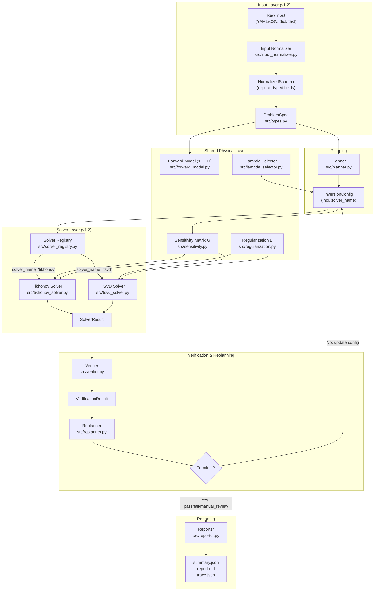

# System Architecture — v1.2

**tikhonov_agent: A Scientific Workflow / Agent Prototype for Thermal Inverse PDE Problems**

> **Validated use case (current version):**
> 1D transient inverse heat conduction problem (IHCP) — boundary heat flux reconstruction.
> All benchmark, ablation, and stress results presented in the paper are for this use case.

---

## 1. Overview

`tikhonov_agent` implements a deterministic, rule-based scientific agent that
autonomously orchestrates the full inversion pipeline for a 1D transient IHCP.

The system is an *agent* in the workflow sense: it plans, acts, evaluates its
own output, and revises its strategy without a human in every loop iteration and
without an LLM making scientific decisions.

The core loop follows the pattern:

> **Plan → Solve → Verify → Replan → Accept / Escalate**

Version 1.2 adds two extensibility layers (Input Normalizer and Solver Registry)
on top of the validated v1.0 scientific core, without changing the validated
inversion logic.

---

## 2. Architecture Diagram



**ASCII fallback** (for renderers without Mermaid):

```
Raw Input (YAML / dict / text)
       │
       ▼
 Input Normalizer ──► NormalizedSchema ──► ProblemSpec
                                                │
                                                ▼
                                           Planner ──► InversionConfig
                                                             │
                                    ┌────────────────────────┘
                                    ▼
                            Solver Registry
                           ┌──────┴──────┐
                    Tikhonov         TSVD
                           └──────┬──────┘
                                  ▼
                            SolverResult
                                  │
                                  ▼
                             Verifier ──► VerificationResult
                                  │
                                  ▼
                            Replanner ──► [loop back to InversionConfig]
                                  │
                          (terminal action)
                                  ▼
                             Reporter ──► summary.json / report.md / trace.json

Shared physical layer (used by both solvers):
  Forward Model (1D FD) ──► Sensitivity Matrix G ──► Regularization L
  Lambda Selector ──► InversionConfig
```

---

## 3. Module Descriptions

### 3.1 Input Layer (v1.2)

#### `src/input_normalizer.py` — Input Normalizer / Schema Builder
Converts multiple raw input representations into a single typed `NormalizedSchema`
dataclass.  Three entry points:
- `normalize_from_yaml(path)` — structured YAML + CSV (primary workflow path)
- `normalize_from_dict(data)` — Python dict (API or partial data)
- `normalize_from_text(text)` — lightweight regex extraction from semi-structured prose

The `NormalizedSchema` has explicit, unit-annotated fields (`rod_length_m`,
`density_kg_m3`, etc.) and validation methods (`is_complete()`, `missing_fields()`).
It converts to a `ProblemSpec` via `.to_problem_spec()`.

Scope note: the text extractor uses deterministic regex patterns.  Robust
free-form natural-language parsing requires a plugged-in `ProblemParserLLM`
adapter (protocol defined in `llm_hooks.py`).

#### `src/parser.py` — Structured Parser (existing)
Original YAML + CSV → `ProblemSpec` path.  Still the authoritative low-level
parser for the experiment pipeline.  The Input Normalizer reads YAML independently
and produces identical `ProblemSpec` objects.

#### `src/types.py` — Type Definitions
All scientific dataclasses: `ProblemSpec`, `InversionConfig`, `SolverResult`,
`VerificationResult`, `AgentTrace`, `RunSummary`.  Single source of truth for
all types used across modules.

---

### 3.2 Forward Model and Sensitivity (shared)

#### `src/forward_model.py` — 1D FD Heat Conduction Forward Solver
Solves the 1D transient heat equation via implicit finite differences.  Given
a time-varying boundary heat flux q(t), returns simulated temperatures at any
set of sensor positions.  Used both for sensitivity matrix construction and
for baseline computation.

#### `src/sensitivity.py` — Response Matrix G
Builds the sensitivity (response) matrix G using the unit-pulse method.  For a
piecewise-constant parameterisation with N_params segments:
- G[:, j] = (response to unit flux in segment j) − (zero-flux baseline)
- Shape: (n_sensors × n_time, n_params)

This is the core linearisation that enables both Tikhonov and TSVD inversion.

#### `src/regularization.py` — Regularization Matrix L
Constructs finite-difference regularization matrices for orders 0, 1, and 2,
used by the Tikhonov solver and (for diagnostic norms) by TSVD.

#### `src/lambda_selector.py` — Lambda / Truncation Parameter Selector
Five strategies: `fixed`, `lcurve`, `gcv`, `discrepancy`, `grid_search`.
L-curve, GCV, and discrepancy are designed for Tikhonov.  For TSVD, the
planner forces `fixed` with a sensible default threshold unless overridden.

---

### 3.3 Planning

#### `src/planner.py` — Rule-Based Planner
Produces an initial `InversionConfig` from the `ProblemSpec`.  All decisions
are deterministic and logged:
- `num_parameters` ≈ N_t / 5, clamped to [5, 50]
- `reg_order = 1` (first-difference smoothness) by default
- `lambda_strategy`: discrepancy if noise_std available, else L-curve
- `solver_name`: read from overrides (default "tikhonov"); TSVD guard
  auto-sets `strategy=fixed, value=0.01` if no explicit lambda is given

---

### 3.4 Solver Layer (v1.2)

#### `src/solver_registry.py` — Solver Registry
Lightweight dict-based registry.  New solvers are added by calling
`registry.register(name, module)`.  The agent dispatches through
`get_registry().solve_single(config.solver_name, ...)`.

Registered solvers:
| Name | Module | Method |
|------|--------|--------|
| `tikhonov` | `src/tikhonov_solver.py` | Normal equations with L2 regularization |
| `tsvd` | `src/tsvd_solver.py` | Truncated SVD inversion |

#### `src/tikhonov_solver.py` — Tikhonov Solver (primary, validated)
Solves `min_x ||Gx − y||² + λ||Lx||²` via normal equations using
`scipy.linalg.lstsq`.  Computes condition estimates, applies physical bounds
clamping.  The only solver used in all v1.0 and v1.1 benchmark results.

#### `src/tsvd_solver.py` — TSVD Solver (v1.2, secondary)
Solves via truncated SVD: `x_k = V_k S_k⁻¹ U_kᵀ y`.
Lambda parameter is reinterpreted as a truncation threshold fraction
(`keep s_j iff s_j / s_max ≥ λ`).
Same `(G, y, config, lam) → SolverResult` interface as Tikhonov.
Status: functional, not yet benchmarked at full benchmark scale.

---

### 3.5 Verification and Replanning

#### `src/verifier.py` — Multi-Criteria Verifier
Seven scientific checks applied to every solver output:
1. Replay RMSE and relative error vs observations
2. First-difference roughness (L1 and L2)
3. Oscillation score (scale-invariant)
4. Physical bounds compliance
5. Morozov discrepancy principle (when noise_std available)
6. Stability across neighboring lambda values
7. Tradeoff diagnosis: under/well/over-regularized

Decision outcomes: `pass`, `weak_pass`, `fail`, `manual_review`.

Thresholds (defaults): `rmse_pass=0.5 K`, `rmse_weak=2.0 K`,
`rel_error_pass=2%`, `osc_pass=1.0`, `osc_fail=5.0`.

#### `src/replanner.py` — Rule-Based Replanner
Priority-ordered rule dispatch that modifies `InversionConfig` after each
verification failure.  Key rules:
- Under-regularized + oscillation: escalate `reg_order` (0→1→2) or increase λ
- Over-regularized: decrease λ
- Stability failure: halve `num_parameters`
- `weak_pass` with high relative error: decrease λ slightly
- `max_retries` exceeded: `stop_with_failure`

Terminal actions: `stop_success`, `stop_success_weak_pass`,
`stop_with_manual_review`, `stop_with_failure`.

---

### 3.6 Reporting

#### `src/reporter.py` — Reporter
Writes three output files per run to `outputs/<timestamp>/`:
- `summary.json` — machine-readable: final status, solver name, lambda, norms,
  config dict, estimated_x, fitted_y
- `trace.json` — per-iteration: lambda, RMSE, tradeoff label, replanning action
- `report.md` — human-readable: problem summary, solver config, estimated
  parameters, iteration trace, warnings

---

## 4. Current Validated Scope

| Aspect | Description |
|--------|-------------|
| Problem | 1D transient IHCP, boundary heat flux reconstruction |
| Forward model | 1D implicit finite-difference heat equation |
| Geometry | Homogeneous 1D rod |
| Material | Isotropic, temperature-independent properties |
| Inversion target | Time-varying boundary heat flux q(t) |
| Parameterization | Piecewise-constant segments |
| Primary solver | Tikhonov regularization (fully validated) |
| Lambda selection | L-curve, GCV, discrepancy principle, fixed, grid |
| Benchmark | 30 synthetic cases (5 flux families × 3 noise levels × 2 seeds) |
| Ablation | 7 variants across 30 cases |
| Stress tests | 6 scenarios (high noise, few sensors, distant sensors, low temporal resolution, high dimension, misspecified noise) |

---

## 5. Extensibility Mechanisms (v1.2)

These are the current extensibility hooks.  They are not the main validated
contribution — they are packaging improvements to support future work.

| Mechanism | How to extend |
|-----------|---------------|
| New input format | Implement and register with `normalize_from_*()`; or plug in a `ProblemParserLLM` adapter |
| New solver | Implement `solve_single(G, y, config, lam) → SolverResult` and `solve_grid(...)`; call `get_registry().register(name, module)` |
| New lambda strategy | Add a case to `lambda_selector.py:select_lambda()` |
| New verification check | Add a check in `verifier.py:verify()` |
| New replanning rule | Add a rule in `replanner.py:replan()` with a priority order note |
| New output format | Add a `_write_*` method in `reporter.py:Reporter` |

---

## 6. Future Work (Not Implemented)

These are planned extensions.  None are implemented or benchmarked in the
current paper.

| Extension | Approach | Scope impact |
|-----------|----------|--------------|
| Bayesian posterior sampler | MCMC or variational | Uncertainty quantification |
| ABC (Approximate Bayesian Computation) | Likelihood-free inference | Non-Gaussian noise |
| Ensemble Kalman Smoother (EnKS) | Sequential data assimilation | Streaming / real-time data |
| Piecewise-linear / B-spline parameterization | Extend `sensitivity.py` | Smoother flux profiles |
| Non-linear forward model | Iterative / adjoint approach | Material nonlinearity |
| 2D / 3D geometry | Replace `forward_model.py` | Broader spatial problems |
| Physics-Informed Neural Networks | Surrogate model | Data-driven inference |
| LLM-driven planning | Plug in `ProblemParserLLM` | Free-form natural language input |

---

## 7. Key Design Decisions

**Why rule-based rather than LLM-based?**
Determinism and reproducibility are first-order requirements for a scientific
inversion system.  Every planning and replanning decision is explicit, logged,
and auditable in the `AgentTrace`.  An LLM-optional hook exists for report
narration and input parsing but is never used for scientific decisions.

**Why Tikhonov as the primary solver?**
Tikhonov regularization (Tikhonov and Arsenin, 1977) is the standard
analytically-grounded method for this class of ill-posed problem.  It has
well-understood regularization properties, an efficient normal-equation
implementation, and connects directly to the L-curve and discrepancy-principle
lambda selection strategies.

**Why add TSVD now?**
To demonstrate that the solver registry abstraction is functional and that
the same agent workflow (sensitivity matrix, verifier, replanner, reporter)
is solver-agnostic.  TSVD is the second-simplest deterministic linear inversion
method for this problem class.  It shares the same G matrix and verifier, making
it a minimal integration test for the registry pattern.

**Why piecewise-constant parameterization?**
Simple, interpretable, and sufficient for the benchmark flux families
(step, ramp, single_pulse, multi_pulse, smooth_sinusoid).  Piecewise-linear
and B-spline parameterizations are natural extensions but add implementation
complexity without adding scientific insight for the current validation scope.
